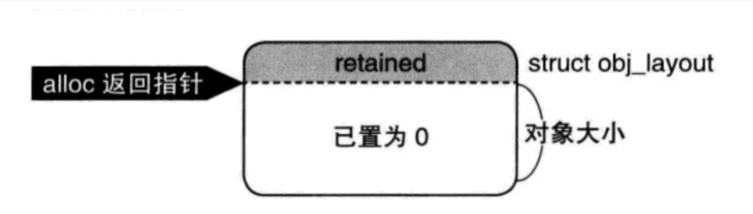
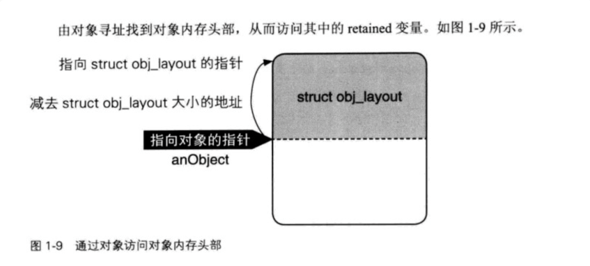
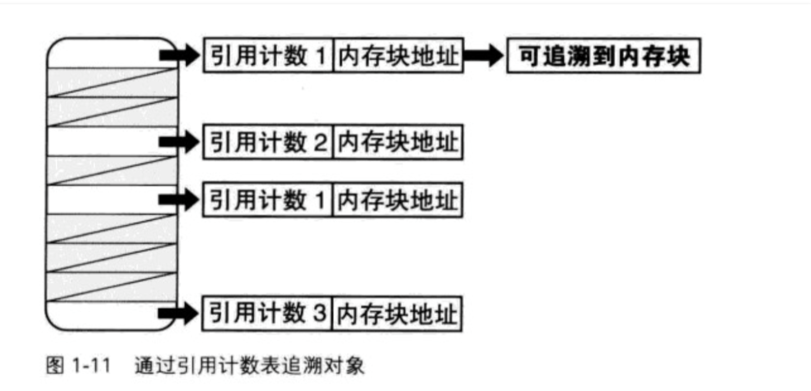

#iOS面试：alloc, retain, dealloc
##1 alloc 
对一个对象进行`alloc`，会调用`allocWithZone`，从而走向C方法 `NSAllocateObject`

```
inline id
NSAllocateObject (Class aClass, NSUInteger extraBytes, NSZone *zone)
{
  id   new;
  int size;
  
  //1. 要分配的内存总字节大小 = 对象的长度字节 + 额外字节 + obj_layout实例长度字节
  size = class_getInstanceSize(aClass) + extraBytes + sizeof(struct obj_layout);
  
  //2. 分配上面计算出的size大小的内存空间
  new = NSZoneMalloc(zone, size);
  
  //3.
  if (new != nil)
    {
      //3.1 内存数据全部初始化为0，包括obj_layout.retainCount也是0
      memset (new, 0, size);
      
      //3.2  因为new指向整个空间主要分为两部分:
      // new[0]: 存放`obj_layout结构体`实例，保存的是retainCount值
      // new[1 ~ size-1]:  存放的是`对象`数据
      //所以这里，alloc最终要返回对象数据的起始地址 &new[1]
          new = (id)&((obj)new)[1];
          
          // 3.3 分配内存对应的objc_class实例
          object_setClass(new, aClass);
    }
  
  retrun new;
}
```

从中我们可以看到一个对象的结构是，[0]存放引用计数器, ［1］指向了对象内存地址

可以看成`obj_layout`放在了内存空间的第一个地址单元，用来存放引用计数器，而申请的内存空间的另一块用来存放对象，当申请到 `sizeof(obj_layout) + sizeof(objc_class)` 这样总长度内存空间之后，使用 `struct obj_layout *` 的指针变量类型来对总内存空间的首地址`new`进行强制转换，得到的是`obj_layout` 实例占用头部的整个空间，继而此时p指向的是`obj_layout`实例占用的整个空间的起始地址

##2. retainCount
 调用`retainCount`方法的时候，会调用`NSExtraRefCount`方法

```
 - (NSUInteger) retainCount
{
#if  GS_WITH_GC
  return UINT_MAX;
#else
  return NSExtraRefCount(self) + 1;
#endif
}
```
而NSExtraRefCount中的实现为：

```
inline NSUInteger
NSExtraRefCount(id anObject)
{
#ifdef __OBJC_GC__
  if (objc_collecting_enabled())
    {
      return UINT_MAX-1;
    }
#endif
#if  GS_WITH_GC
  return UINT_MAX - 1;
#else    /* GS_WITH_GC */
  return ((obj)anObject)[-1].retained;
#endif /* GS_WITH_GC */
}
```
在iOS中 我们只需要看到最后一句

```
return ((obj)anObject)[-1].retained;
```
这里返回的是对象内存指针的上一个地址的retianed属性

##3 retain 
retain最终调用的是`NSIncrementExtraRefCount`方法，并且返回`self`自身

```
- (id) retain {

  // 自增retained
  NSIncrementExtraRefCount(self);
  
  // 返回当前对象
  return self;
}
```

```
inline void
NSIncrementExtraRefCount(id anObject)
{
  if (allocationLock != 0)
    {
      if (多线程环境){
		多线程加锁处理...
		((obj)anObject)[-1].retained++;
		} else { // 非多线程 
		((obj)anObject)[-1].retained++;
	    }
    }
 }
```
我们可以看到简化后，不管是不是多线程环境，都要调用到`((obj)anObject)[-1].retained++`
##4. dealloc

```
- (void) dealloc
{
  NSDeallocateObject (self);
}
```

```
inline void
NSDeallocateObject(id anObject)
{
  // 获取当前对象对应的 objc_class实例
  Class aClass = object_getClass(anObject);
  
  // 
  if ((anObject != nil) && !class_isMetaClass(aClass)) {
      
      // 取出对象上面的obj_layout实例
      obj  o = &((obj)anObject)[-1];
      
      // 根据obj_layout实例，获得当前对象存放在哪一个区域Zone
      NSZone   *z = NSZoneFromPointer(o);
      
      // 将当前对象的objc_class实例设置为: 0xdeadface
      object_setClass((id)anObject, (Class)(void*)0xdeadface);
      
      // 最后释放掉对象，将obj_layout实例空间的起始地址所在内存全部free()
      NSZoneFree(z, o);
  }
}
```

##iOS中的策略
然而上面说的是GNUStep中的实现，在NS中，不再是引用计数器与对象存于同一个地方，而是有一张专门的表来处理引用计数器

使用内存块地址作为key值，内存块对应的引用计数作为value值，保存在表中。那么GNUStep如上实现基本上和苹果的一致，只是在引用计数器存放的问题上有所不同:

GNUStep将引用计数器存放在obj_layout实例中，继而将obj_layout实例与对象实例存放在同一个内存块，并放在头部存放

- 苹果将引用计数器放在了一个表来进行管理

- 在使用工具进行内存泄露监测时，实际上就是从表中查看，所有的内存块是否存在持有者（引用计数器是否大于0）