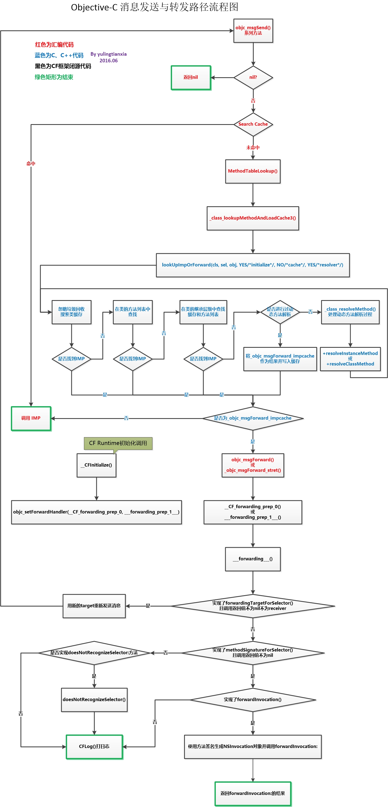

#Objective-C 中的消息与消息转发
##1. 发送消息
`[receiver message];`
都会被转化成
`objc_msgSend(receiver, @selector(message));`

`[object hello] -> objc_msgSend(object, @selector(hello))`

我们看一下苹果对于objc_msgSend的官方说明
`id objc_msgSend(id self, SEL _cmd, ...)`
其中self是消息接收对象，**_cmd**是需要发送消息的**Selector**，...是可变参数列表
>当向一般对象发送消息时，调用objc_msgSend；当向super发送消息时，调用的是objc_msgSendSuper； 如果返回值是一个结构体，则会调用objc_msgSend_stret或objc_msgSendSuper_stret。

使用objc_msgSend的时候需要对方法进行强制转换
`((void (*)(id, SEL))(void *)objc_msgSend)((id)receiver, sel_registerName("message"));`
每一个方法都默认有两个参数，调用方法的对象和方法的SEL

##1.1 selector
 @selector(hello) 生成的选择子 SEL
 
 >结论：
 >使用 @selector()生成的选择子不会因为类的不同而改变，其内存地址在编译期间就已经确定了。也就是说向不同的类发送相同的消息时，其生成的选择子是完全相同的。
 
 
1. Objective-C 为我们维护了一个巨大的选择子表
2. 在使用 @selector()时会从这个选择子表中根据选择子的名字查找对应的 SEL。如果没有找到，则会生成一个 SEL 并添加到表中
3. 在编译期间会扫描全部的头文件和实现文件将其中的方法以及使用 @selector() 生成的选择子加入到选择子表中

##1.2 消息发送的过程
objc_msgSend的伪代码
```
id objc_msgSend(id self, SEL _cmd, ...) {
  Class class = object_getClass(self);
  IMP imp = class_getMethodImplementation(class, _cmd);
  return imp ? imp(self, _cmd, ...) : 0;
}
```
`class_getMethodImplementation`中对于方法的查找步骤:
1. `NilTest` 判断接受消息的对象是否为nil，如果为nil久直接返回nil，这里解释了为什么向nil对象发送消息不会产生奔溃，因为消息在这里判断后直接忽略掉
2. `CacheLookup` 在类的缓存中查找 selector 对应的 IMP（放到 r10）并执行。如果缓存没中，那就得到 Class 的方法表中查找了。
3. `MethodTableLookup` 负责在缓存没命中时在方法表中负责查找 IMP
4. `lookUpImpOrForward` 快速查找 IMP，判断这个类是否实现初始化，如果类没有初始化，会调用类的`initialize`对类进行初始化操作,然后在类的methodLists里进行查找，如果查找不到就从继承体系里面查找

##2. 消息转发
如果在上面的方法中还是找不到对应的方法，就会进入以下的消息转发过程
1. 先调用 forwardingTargetForSelector 方法获取新的 target 作为 receiver 重新执行 selector，如果返回的内容不合法（为 nil 或者跟旧 receiver 一样），那就进入第二步。
2. 调用 methodSignatureForSelector 获取方法签名后，判断返回类型信息是否正确，再调用 forwardInvocation 执行 NSInvocation 对象，并将结果返回。如果对象没实现 methodSignatureForSelector 方法，进入第三步。
3. 调用 doesNotRecognizeSelector 方法。

![消息转发]](./1467186082514.png)

过程说明
在上一步类和父类中找不到对应的方法，会根据当前的类是不是元类在 _class_resolveInstanceMethod 和 _class_resolveClassMethod 中选择一个进行调用
```
static void _class_resolveInstanceMethod(Class cls, SEL sel, id inst) {  
    if (! lookUpImpOrNil(cls->ISA(), SEL_resolveInstanceMethod, cls, 
                         NO/*initialize*/, YES/*cache*/, NO/*resolver*/)) {
        // 没有找到 resolveInstanceMethod: 方法，直接返回。
        return;
    }

    BOOL (*msg)(Class, SEL, SEL) = (__typeof__(msg))objc_msgSend;
    bool resolved = msg(cls, SEL_resolveInstanceMethod, sel);

    // 缓存结果，以防止下次在调用 resolveInstanceMethod: 方法影响性能。
    IMP imp = lookUpImpOrNil(cls, sel, inst, 
                             NO/*initialize*/, YES/*cache*/, NO/*resolver*/);
}
```
在这里如果有实现resolveInstanceMethod就会进行消息转发，如果没有，直接奔溃，如果实现了resolveInstanceMethod会在之类也进行方法缓存，下次调用该方法直接可以在缓存中查找到

##2.1 resolveInstanceMethod
在这里会根据方法是对象方法还是类方法进行不同的调用`resolveInstanceMethod`或者`resolveClassMethod`
在这里可以利用runtime的class_addMethod来对选择子指定对应的IMP实现指针，返回YES，这样就能让消息得到响应
##2.2 备用接收者 forwardingTargetForSelector
在这里会把消息转发给其他的接收者来处理，这样可以做到多继承的效果
##2.3 完整的消息转发
`- forwardInvocation` NSInvocation对象包含了选择子，目标及参数。只需要在这个方法中改变方法目标，使目标在新的目标上得以调用即可



#参考资料
[Objective-C 消息发送与转发机制原理](http://yulingtianxia.com/blog/2016/06/15/Objective-C-Message-Sending-and-Forwarding/)
[从源代码看 ObjC 中消息的发送](http://draveness.me/message/)


