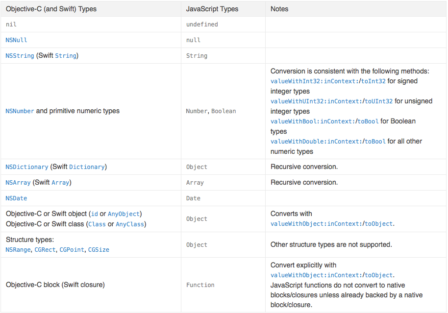
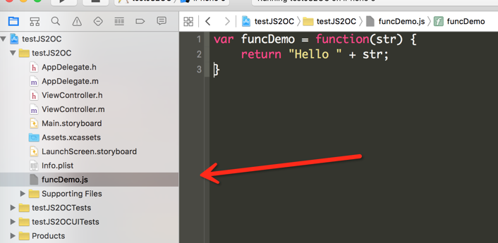

#iOS 动态更新
##1. 背景
###1.1  常见的动态更新：
1. webView加载H5
2. react native动态更新
3. 下发脚本文件执行动态更新
##1.2苹果官方允许下发的可执行文件
只有两种:
1. lua 脚本
2. js 脚本
两个常用的框架
1. waxpatch : lua 
2. jspatch : js

##2. jspatch与waxpatch
1. jspatch 用javascript代码调用原生代码
2. waxpatch 用lua调用原生代码
3. jaspatch使用系统内置的javaScriptCore.framework，无需内嵌lua脚本引擎来运行lua代码
4. 苹果规定动态更新代码只能通过JavaScriptCore.framework或WebKit执行的代码，所以jspatch更符合苹果规定
5. jspatch只能修复iOS7之后的版本，因为javaScriptCore.framework是在iOS7之后加入的

>jspatch 实现了 js->javaScriptCore.framework->OC

##3. 使用jspatch需要注意的点
1. jspatch是通过服务器下发js脚本在手机本地进行动态更新
2. 在网络动态下发js脚本的过程中，会很容易被人串改和恶意攻击，因此需要加密，可以使用https来解决
3. js脚本下发后也需要进行加密处理，防止被反编译或者是越狱的系统直接修改脚本文件

##4. javaScriptCore
我们知道js是通过javaScriptCore来调用的，那么我们一起来看一下javaScriptCore里面有什么内容：

```
#import "JSContext.h"
#import "JSValue.h"
#import "JSManagedValue.h"
#import "JSVirtualMachine.h"
#import "JSExport.h"
```

##4.1  javaScriptCore类介绍
它暴露了这几个类，我们查一下官方文档对这几个类分别的描述
1. JSContext:
```
JSContext : 
A JSContext object represents a JavaScript execution environment. You create and use JavaScript contexts to evaluate JavaScript scripts from Objective-C or Swift code, to access values defined in or calculated in JavaScript, and to make native objects, methods, or functions accessible to JavaScript.
```
从官方文档可以看出，JSContext是用来创建一个javaScript环境，用来运行js代码

2. JSValue:

```
A JSValue instance is a reference to a JavaScript value. You use the JSValue class to convert basic values (such as numbers and strings) between JavaScript and Objective-C or Swift representations in order to pass data between native code and JavaScript code
```
用来做OC代码和js代码之间的转换

3.  JSManagedValue

```
A JSManagedValue object wraps a JSValue object, adding “conditional retain” behavior to provide automatic memory management of values. The primary use case for a managed value is to store a JacaScript value in an Objective-C or Swift object that is itself exported to JavaScript.
```
JSManagedValue 是用来解决OC对象和JS对象之间不同的内存管理机制，来防止不同的内存管理机制导致相互转化的时候对象被释放。用来包装**JSValue**对象

4. JSVirtualMachine

```
A JSVirtualMachine instance represents a self-contained environment for JavaScript execution. You use this class for two main purposes: to support concurrent JavaScript execution, and to manage memory for objects bridged between JavaScript and Objective-C or Swift.
```
大致意思是为javascriptti 工一个独立环境，使用这个有两个目的，用来支持js执行，和管理js与原生代码之间的桥接的内存管理

5. JSExpor

```
The JSExport protocol provides a declarative way to export Objective-C instance classes and their instance methods, class methods, and properties to JavaScript code.
```
JSExport提供了一个协议，允许js直接调用遵循了这个协议的类的类方法，实例方法，和属性

###4.2 js与OC之间的类型转换关系

###4.3 jspatch 的核心
jspatch的核心是在消息转发的时候，利用runtime来替换OC方法的SEL和对应的IMP指针

##5.几个小例子
###5.1 调用js方法

```
// 1. 创建js上下文环境
JSContext *context = [JSContext new];

// 2. 在js环境中执行js代码
[context evaluateScript:@"function helloworld(str) { return \"Hello \" + str; }"];

// 3. 取出js环境中的js方法
JSValue *helloworld = context[@"helloworld"];
NSLog(@"%@", helloworld);

// 4. 调用js方法
JSValue *number = [helloworld callWithArguments:@[@"kingsly"]];
NSLog(@"%@", number);
```

打印结果

```
2016-06-16 15:04:27.824 testJS2OC[55038:1945148] function helloworld(str) { return "hello " + str; }
2016-06-16 15:04:27.825 testJS2OC[55038:1945148] hello kingsly
```
###5.2 调用js脚本文件里的方法


```
//1 . 读取js代码内容
NSString *path = [[NSBundle mainBundle] pathForResource:@"funcDemo" ofType:@"js"];
NSString *textScript = [NSString stringWithContentsOfFile:path encoding:NSUTF8StringEncoding error:nil];

// 2. 创建运行时的js代码环境
JSContext *context = [JSContext new];

// 3. 执行本地脚本
[context evaluateScript:textScript];

// 4. 从js运行环境中读取方法
JSValue *func = context[@"funcDemo"];

JSValue *result = [func callWithArguments:@[@"kingsly" ]];


NSLog(@"%@", [result toString]);
```
打印结果：

```
2016-06-16 15:23:38.269 testJS2OC[55183:1959546] Hello kingsly
```
###5.3 js调用OC的方法
现在申明一个Protocol，遵循JSExport，在protocol里定义方法

```
#import <Foundation/Foundation.h>
#import <JavaScriptCore/JavaScriptCore.h>
@protocol JSExportProtocol <JSExport>
- (void)printName:(NSString *)name;
@end
```

在Controller里：

```
- (void)callJavaScrripDemo4 {
    JSContext *context = [JSContext new];
    
    // 将上面实现的自定义的协议的对象设置给JSContext
    context[@"viewController"] = self;
    
    [context evaluateScript:@"viewController.printName('Kingsly')"];
}

#pragma mark - delegate
- (void)printName:(NSString *)name {
    NSLog(@" Hello , %@", name);
}
```

打印结果 ：

```
2016-06-16 18:21:01.302 testJS2OC[57420:2069949]  Hello , Kingsly
```
